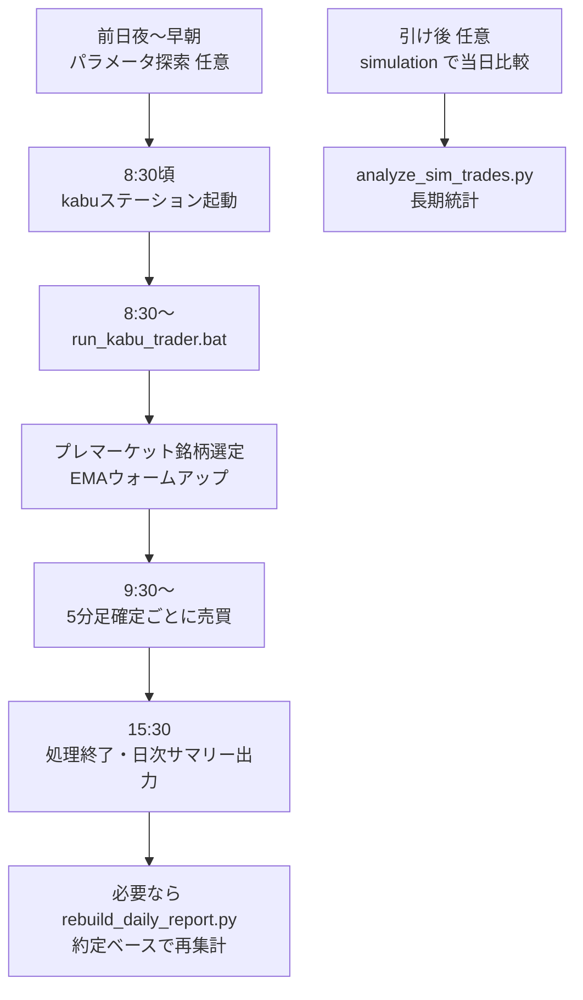

# 日次売買オペレーションガイド

日経225構成銘柄を対象に、EMAゴールデンクロス＋出来高急増でエントリーし、デッドクロス・ストップロス・TimeLimitで決済する **本番ライブ売買** の手順とファイル構成をまとめたドキュメントです。

戦略ロジックは `simulation_realistic.py`（バックテスト）と `kabu_trader.py`（ライブ）で共通化されています。

---

## 1. 日次の流れ（概要）



| 時刻（JST） | 処理 |
|-------------|------|
| 前日夜 / 早朝（推奨） | 日次パラメータ探索（`run_jp_scheduled_daily.bat`） |
| 8:30 前後 | kabuステーション起動・API有効化 |
| 8:30〜 | `kabu_trader.py` 起動（銘柄選定・EMA準備） |
| 9:00〜9:30 | 寄り後ブロック（新規エントリー不可） |
| 9:30〜14:45 | エントリー可能 |
| 14:45〜 | 新規エントリー禁止 |
| 15:15〜 | TimeLimit 強制決済 |
| 15:30 | ループ終了・`summary_*.json` 出力 |

---

## 2. 前提環境

### 必須ソフトウェア

| 項目 | 内容 |
|------|------|
| OS | Windows（本番運用は `.bat` 想定） |
| Python | 3.11 推奨（`.bat` 内のパスに合わせる） |
| kabuステーション | 三菱UFJ eスマート証券。本番 API は `localhost:18080` |
| ネットワーク | yfinance による履歴取得（銘柄選定・シミュ用） |

### Python パッケージ

`requirements.txt` に記載のほか、実際には以下も使用します。

```bash
pip install pandas numpy yfinance scipy requests beautifulsoup4
```

### 設定ファイル `kabu_config.json`

ライブ売買の中心設定です。**APIパスワード・取引パスワードを含むため、Git へのコミットは避けてください。**

| キー | 説明 |
|------|------|
| `api_password` | kabu API 認証用 |
| `trade_password` | 発注時の取引パスワード |
| `base_url` | 検証: `http://localhost:18081/kabusapi` / 本番: `http://localhost:18080/kabusapi` |
| `is_production` | `true` で本番 URL を使用（`--production` と併用） |
| `account_type` | 口座種別（4=特定 など） |
| `rank_fraction` | 監視銘柄の上位比率（例: 0.48 → 225銘柄中約108銘柄） |
| `volume_mult` | 出来高が20本平均の何倍以上でエントリーするか（例: 1.38） |
| `stop_loss_pct` | ストップロス幅（例: 0.005 = 0.5%） |
| `max_position_value_pct` | 1回の買いに使う買付可能額の上限比率（1.0=全額） |
| `max_lot_value_yen` | 100株想定購入金額の上限（超える銘柄は選定除外） |
| `yf_period` | yfinance 取得期間（既定 `59d`） |

現在の運用パラメータ例: `rank_fraction=0.48`, `volume_mult=1.38`

---

## 3. 起動方法

### 3.1 本番ライブ売買（メイン）

**タスクスケジューラや手動で、市場前（8:30 前後）に実行します。**

```bat
run_kabu_trader.bat
```

内部で実行されるコマンド:

```bash
python -u kabu_trader.py --production
```

| オプション | 用途 |
|------------|------|
| `--production` | 本番 API（18080）・実発注 |
| `--signal-only` | 板情報・シグナル検出のみ（発注なし） |
| `--dry-run` | API なしのロジック確認 |
| `--config PATH` | 設定ファイルの上書き |

シグナル確認のみ:

```bat
run_kabu_trader_signal_only.bat
```

### 3.2 日次パラメータ探索（推奨: 売買の前日〜早朝）

直近約60営業日のシミュで `rank_fraction` / `volume_mult` を微調整し、ベスト値を `kabu_config.json` に書き込みます。

```bat
run_jp_scheduled_daily.bat
```

```bash
python jp_scheduled_param_search.py --mode daily --apply-kabu-config
```

週次フル探索（組み合わせ数が多く時間がかかる）:

```bat
run_jp_scheduled_weekly.bat
```

### 3.3 当日シミュレーション（ライブ結果との比較）

`kabu_config.json` と同じパラメータで当日を再現します。

```bash
python simulation_realistic.py --single-date 2026-06-08 --rank-fraction 0.48 --volume-mult 1.38 --max-symbols 135
```

または:

```bash
python simulation_realistic.py --today --rank-fraction 0.48 --volume-mult 1.38 --max-symbols 135
```

### 3.4 日次レポートの再生成（約定照会ベース）

終了時の自動サマリーが理論値のままの場合や、旧ログの補正時に使用します。**kabuステーションが起動している必要があります。**

```bash
python rebuild_daily_report.py --date 2026-06-08
```

### 3.5 シミュ長期統計

```bash
python analyze_sim_trades.py
```

出力: `sim_trade_stats.json`

---

## 4. ファイル一覧と役割

### 4.1 コア（日次売買に必須）

| ファイル | 役割 |
|----------|------|
| `kabu_trader.py` | **ライブトレーダー本体**。板情報から5分足を構築し、GC/DC・出来高・SL・TimeLimit で売買。終了時に約定照会で損益を補正 |
| `kabu_api.py` | kabuステーション REST API ラッパー（認証・発注・板情報・余力・約定照会） |
| `kabu_config.json` | API接続・戦略パラメータ・口座設定 |
| `simulation_realistic.py` | **バックテスト／戦略の単一ソース**。銘柄選定・セッション制限・EMAロジックをライブと共有 |
| `nikkei225_list.py` | 日経225 225銘柄のティッカー・社名リスト |
| `run_kabu_trader.bat` | 本番ライブ起動用バッチ |

### 4.2 パラメータ最適化（日次運用で推奨）

| ファイル | 役割 |
|----------|------|
| `jp_scheduled_param_search.py` | 週次フル探索 / 日次ローカル探索のスケジューラ |
| `jp_profit_focused_rescore.py` | 採用スコア（リターン・MDD・CVaR 等）の計算式 |
| `jp_objective_sweep.py` | スコア計算の補助（MDD・集中度など） |
| `run_jp_scheduled_daily.bat` | 日次パラメータ探索の起動 |
| `run_jp_scheduled_weekly.bat` | 週次フル探索の起動 |
| `jp_param_search_state.json` | 探索の状態（前回ベスト `rank_fraction` / `volume_mult`）。実行時生成・Git管理外 |
| `jp_scheduled_param_search_result.json` | 直近実行の詳細結果。実行時生成・Git管理外 |

### 4.3 分析・レポート補助

| ファイル | 役割 |
|----------|------|
| `rebuild_daily_report.py` | 過去日の `trades_*.jsonl` を約定照会し `summary_*.json` を再生成 |
| `analyze_sim_trades.py` | シミュ全期間の勝率・平均損益・保有時間を集計 |
| `run_kabu_trader_signal_only.bat` | 発注なしのシグナル検証用 |

### 4.4 実行時に生成・更新されるファイル

| ファイル / ディレクトリ | 役割 |
|-------------------------|------|
| `kabu_logs/live_trading_YYYY-MM-DD.log` | 本番売買の詳細ログ（UTF-8） |
| `kabu_logs/signal_live_YYYY-MM-DD.log` | `--signal-only` 時のログ |
| `kabu_logs/trades_YYYY-MM-DD.jsonl` | 買い・売りイベントの1行1JSON |
| `kabu_logs/summary_YYYY-MM-DD.json` | 日次サマリー（件数・合計損益・明細、`pnl_basis: execution`） |
| `kabu_trader_state.json` | 当日のポジション・取引回数・買付可能額のスナップショット |
| `kabu_trader_scheduler.log` | `.bat` 起動・終了の記録 |
| `jp_scheduled_param_search.log` | パラメータ探索バッチのログ |
| `earnings_cache.json` | 決算日情報のキャッシュ（銘柄選定で決算回避に使用） |

### 4.5 リポジトリに含めないもの

研究・検証用の旧スクリプト（米国市場スイープ、walkforward、virtual_bot など）と、探索結果 JSON は Git 管理外です。

---

## 5. 各コンポーネントの処理内容

### `kabu_trader.py`（ライブ）

1. `kabu_config.json` を読み込み、API 認証
2. **プレマーケット選定**: 前日までの yfinance データでモメンタム順位 → 上位 `rank_fraction` を監視候補に（最大135銘柄）
3. **EMA ウォームアップ**: 板情報バッチ取得で5分足履歴を構築
4. **トレーディングループ**（20秒周期・板は45銘柄×3バッチでローテーション）:
   - 5分足確定時: 全銘柄の EMA 更新 → **全決済** → **全エントリー**（シミュと同順序）
   - 成行発注（SOR 市場コード 9）
5. **終了処理**（15:30）: 約定照会で entry/exit/pnl を実値に更新 → `summary_*.json` / `trades_*.jsonl` 保存

### `simulation_realistic.py`（バックテスト）

- yfinance の5分足で同一戦略を過去日に適用
- `run_daily_selection`, `is_entry_blocked_by_session`, `is_time_limit_session` 等をライブから import
- パラメータ探索・当日比較・長期検証の基盤

### `jp_scheduled_param_search.py`（パラメータ更新）

| モード | 探索範囲 |
|--------|----------|
| `weekly` | rank_fraction 0.1〜0.5、volume_mult 1.1〜1.5 を0.01刻みで全探索 |
| `daily` | 前回ベスト中心 ±0.05 を0.01刻み |
| `auto` | 曜日で weekly / daily を自動選択 |

`--apply-kabu-config` 指定時、ベストの `rank_fraction` / `volume_mult` を `kabu_config.json` に上書きします。

---

## 6. 日次チェックリスト

### 売買前

- [ ] kabuステーションが起動し、API が有効
- [ ] `kabu_config.json` の `is_production` / パスワード / パラメータを確認
- [ ] （任意）前日に日次パラメータ探索を実行済み
- [ ] PC のスリープ無効（15:30 まで稼働が必要）

### 売買後

- [ ] `kabu_logs/summary_YYYY-MM-DD.json` の `total_pnl` と `pnl_basis: execution` を確認
- [ ] 買付可能額の変化が合計損益と大きく乖離する場合は `rebuild_daily_report.py` を実行
- [ ] （任意）`simulation_realistic.py --single-date` でシミュと比較
- [ ] エラーが多い日は `live_trading_*.log` で Code 21（資金不足）や 4002006（銘柄登録）を確認

---

## 7. Windows タスクスケジューラ設定例

| タスク名 | 実行ファイル | 推奨時刻 | 備考 |
|----------|--------------|----------|------|
| JP Param Search Daily | `run_jp_scheduled_daily.bat` | 平日 6:00 | データ更新後・売買前 |
| Kabu Live Trader | `run_kabu_trader.bat` | 平日 8:25 | kabuステーション起動後 |
| Kabu Live Trader (週次探索) | `run_jp_scheduled_weekly.bat` | 土曜 9:00 など | 週1回で十分な場合 |

`.bat` 内の Python パス（`C:\Users\...\Python311\python.exe`）は環境に合わせて変更してください。

---

## 8. トラブルシューティング

| 症状 | 確認先・対処 |
|------|--------------|
| 発注されない | 資金不足（全額1銘柄戦略で次のエントリーが Code 21）、`signal-only` でないか |
| シミュと結果が大きく違う | 板ローテーション遅延、成行 vs 終値、エントリー見送り（資金・登録エラー） |
| 損益と財布の差が大きい | T+2 決済による一時的な買付可能額。`rebuild_daily_report.py` で約定ベース再集計 |
| 文字化けログ | 詳細は `kabu_logs/live_trading_*.log`（UTF-8）。コンソールは cp932 の場合あり |
| API 接続失敗 | kabuステーション未起動、ポート 18080/18081、ファイアウォール |

---

## 9. 関連コマンド早見表

```bash
# 本番ライブ
python kabu_trader.py --production

# シグナルのみ
python kabu_trader.py --production --signal-only

# 日次パラメータ探索 → config 反映
python jp_scheduled_param_search.py --mode daily --apply-kabu-config

# 当日シミュ
python simulation_realistic.py --today --rank-fraction 0.48 --volume-mult 1.38 --max-symbols 135

# 約定ベースレポート再生成
python rebuild_daily_report.py --date YYYY-MM-DD

# シミュ統計
python analyze_sim_trades.py
```
